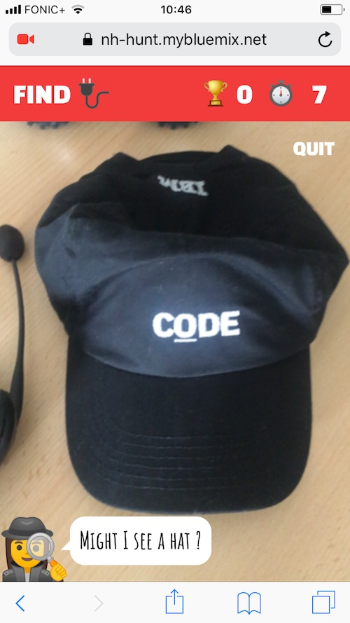

# Deploying Watson Deep Learning Models to Browsers

This project includes sample code how to train a model with [TensorFlow](https://www.tensorflow.org/) and the [Deep Learning service](https://www.ibm.com/blogs/watson/2018/03/deep-learning-service-ibm-makes-advanced-ai-accessible-users-everywhere/) within Watson Studio and how to deploy and access the model in a web browser.

This project extends the open source project [Emoji Scavenger Hunt](https://github.com/google/emoji-scavenger-hunt) which is a web based game that makes use of [TensorFlow.js](https://js.tensorflow.org/) to identify objects seen by your webcam or mobile camera in the browser. Emojis are shown and you have to find those objects in the real world before the timer runs out.

This is a screenshot from the app running on an iPhone where currently a hat is recognized:



I've deployed a [live demo](https://nh-hunt.mybluemix.net) but it will only work for you if you have items that look similar.

Check out the [video](https://youtu.be/4WTpMmqraXI) for a quick demo.

In order to train the model I've taken pictures from seven items: plug, soccer ball, mouse, hat, truck, banana and headphones. Here is how the emojis map to the real objects. You can find the images in the [data](data/images) directory.


## Prerequisites 

Get a free [IBM Cloud](https://ibm.biz/nheidloff) lite account (no time restriction, no credit card required).

Create an instance of the [Machine Learning](https://console.bluemix.net/catalog/services/machine-learning) service. From the credentials get the user name, password and the instance id.

Install the IBM Cloud CLI with the machine learning plugin and set environment variables by following these [instructions](https://datascience.ibm.com/docs/content/analyze-data/ml_dlaas_environment.html).

Create an instance of the [Cloud Object Storage
](https://console.bluemix.net/catalog/services/cloud-object-storage) service and create HMAC credentials by following these [instructions](https://datascience.ibm.com/docs/content/analyze-data/ml_dlaas_object_store.html). Make sure to use 'Writer' or 'Manager' access and note the aws_access_key_id and aws_secret_access_key for a later step.

Install and configure the AWS CLI by following these [instructions](https://console.bluemix.net/docs/services/cloud-object-storage/cli/aws-cli.html#use-the-aws-cli).


## Training of the Model

Clone this repo:

```bash
$ git clone https://github.com/nheidloff/watson-deep-learning-javascript
```

Create two buckets (use unique names):

```bash
$ aws --endpoint-url=http://s3-api.dal-us-geo.objectstorage.softlayer.net --profile ibm_cos s3 mb s3://nh-hunt-input
$ aws --endpoint-url=http://s3-api.dal-us-geo.objectstorage.softlayer.net --profile ibm_cos s3 mb s3://nh-hunt-output
```

Download and extract Mobilenet:

```bash
$ cd watson-deep-learning-javascript/data
$ wget http://download.tensorflow.org/models/mobilenet_v1_2018_02_22/mobilenet_v1_0.25_224.tgz
$ tar xvzf mobilenet_v1_0.25_224.tgz 
```

Upload bucket with MobileNet and data (use your unique bucket name):

```bash
$ cd xxx/watson-deep-learning-javascript/data
$ aws --endpoint-url=http://s3-api.dal-us-geo.objectstorage.softlayer.net --profile ibm_cos s3 cp . s3://nh-hunt-input/ --recursive 
```

Prepare the training:
* Define your object storage credentials and your bucket names in [tf-train.yaml](model/tf-train.yaml).
* Compress [retrain.py](model/retrain.py) into [tf-model.zip](model/tf-model.zip).

Invoke the training and check for status (change the generated training name):

```bash
$ cd xxx/watson-deep-learning-javascript/model
$ bx ml train tf-model.zip tf-train.yaml
$ bx ml list training-runs
$ bx ml monitor training-runs training-5PQK89IiR
$ bx ml show training-runs training-5PQK89IiR
```

Download the saved model:

```bash
$ cd xxx/watson-deep-learning-javascript/saved-model
$ aws --endpoint-url=http://s3-api.dal-us-geo.objectstorage.softlayer.net --profile ibm_cos s3 sync s3://nh-hunt-output .
```

Optionally evaluate the model via Tensorboard (either from Docker container or Virtualenv):

```bash
$ cd xxx/watson-deep-learning-javascript/saved-model/training-0xebs3Iig
$ tensorboard --logdir=xxx/watson-deep-learning-javascript/saved-model/training-0xebs3Iig/retrain_logs
```


## Deployment of the Web Application

Convert the model:

```bash
$ cd xxx/watson-deep-learning-javascript/convert
$ docker build -t model-converter .
$ cp -a xxx/watson-deep-learning-javascript/saved-model/training-qBnjUqImR/model/. xxx/watson-deep-learning-javascript/convert/data/saved_model/ 
$ docker run -v xxx/watson-deep-learning-javascript/convert/data:/data -it model-converter
```

Build the web application (more [details](https://github.com/google/emoji-scavenger-hunt)):

```bash
$ 
cp -a xxx/watson-deep-learning-javascript/convert/data/saved_model_web/. xxx/watson-deep-learning-javascript/emoji-scavenger-hunt/dist/model/
$ cd xxx/watson-deep-learning-javascript/emoji-scavenger-hunt
$ yarn prep
$ yarn build
```

Push the application to IBM Cloud (change host and name in [manifest.yaml](emoji-scavenger-hunt/manifest.yaml) to something unique):

```bash
$ cd xxx/watson-deep-learning-javascript/emoji-scavenger-hunt
$ cf login
$ cf push
```

After this you can open the application via URLs like [https://nh-hunt.mybluemix.net](https://nh-hunt.mybluemix.net).


## Deployment of the Model to Watson Studio

Deploy the model (change training id and model id):

```bash
$ bx ml store training-runs training-qBnjUqImR
$ bx ml deploy 0c78b7d6-9d22-4719-90da-ab649c0edc90 "my-deployment"
```

Predict something for a test image: to be done